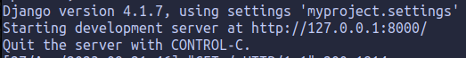

# Сайт портфолио
Написан на:
 * python 3.10
 * Django
 * HTML
 * CSS

________________________

# Запуск через терминал 

Для начала создадим виртуальное окружение в python через теминал:

```
python3 -m venv venv
```

потом запустим виртуальное окружение:

```
source venv/bin/activate
```

запустив вертуальное окружение скачаем библеотеку Django: 

```
pip install django 
```

<h2>Запускаем:</h2>

Переходим в каталог myproject и запускае файл menage.py:

```
python3 manage.py runserver 
```
-------



Запускаем ссылку. Готово